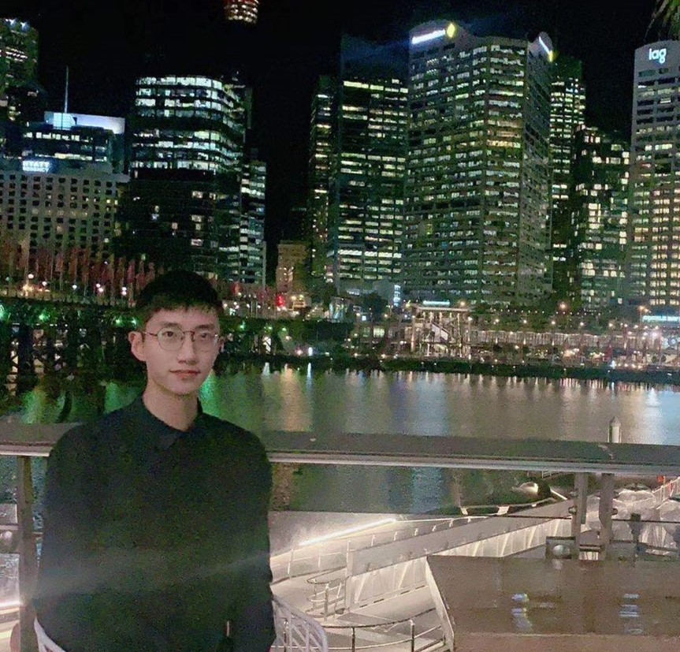

<table border="0">
  <tr>
    <td width="75%">
      <h1>Jincen Song</h1>
      
<b><strong>School of Computer Science, the University of Sydney</strong></b>

      
<b>email:json4256@uni.sydney.edu.au</b>

    </td>
    <td width="25%">
           
    </td>
  </tr>
</table>

## Experience
### 1.The University of Sydney, 2019-Now
- I'm currently a undergraduate student majoring in Computational data science and Statistics from the University of Sydney. I'll graduate with a Bachelor of advanced computing degree(with Honor). My ambition is to become a computer vision researcher in the future. All of my math courses reach 90+ marks, my Calculus'mark is 95, my Linear Algebra's mark is 93.
 
### 2.Computational Intelligence Chongqing Key Laboratory, 2019.1-2019.3
- I am one of the team members in this famous Artificial Intelligence Laboratory in the Southwest of China to learn Computer vision . During this time, I have completed a project for dashboard recognition.

## Interested Research area
1. Computer Vision
2. Image Process
3. Computer Graphics
  
  
## 个人项目展示
1. 自动驾驶车道检测（传统方法和深度学习相结合）
2. 考试防作弊软件（主要用于人脸检测，自己做一个出来）
3. 将yoloV4模型迁移到安卓端上运行
  
  
## Achivements
-  Certified Expert of Alibaba Cloud Community
-  Book author of [***Machinery Industry Press***](https://zh.wikipedia.org/wiki/机械工业出版社)
- [***Human vital signs monitoring software***](https://www.zhifufu.com/software/3496c3efa281493ba640a18d615867c0.html) : The first authour of the Chinese National Software Copyright
  
  
## Skills Summary
### Proficient Programming Skills 
- Mastered many kinds of programming languages ( E.g. Python, Java, C )
- Artificial intelligence framework: Tensorflow, Pytorch, Keras
- Strong capacity in Android software design & development( E.g. Github 25 stars + )
### Basic Knowledge of Computer Vision
- Familiar with <b>Object Detection</b>,such as <b>Yolo, Faster-RCNN, EfficientDet(CVPR 2020)</b> and so on. I have read all of those papers.
- Familiar with <b>Semantic Segmentation</b>，such as <b>FCN, Mask-RCNN.</b>
- Familiar with <b>Graph Neural Network.</b>
### Excellent Interpersonal Communication Skills
- Had worked as a product manager of a technology company , and write software requirements documents for programmers and UI designers.

  
  

## Chinese Tech Blog
- <a href="https://www.cnblogs.com/geeksongs/tag">https://www.cnblogs.com/geeksongs/</a>
 .This blog is over 400,000 times views, followed by 63 people.
  
  
## Github
- <a href="https://github.com/Geeksongs">https://github.com/Geeksongs</a>
## Sincere Appreciate  
  
  
Thank you for spending time reading my resume. 
Looking forward to studying and working under your guidance.

